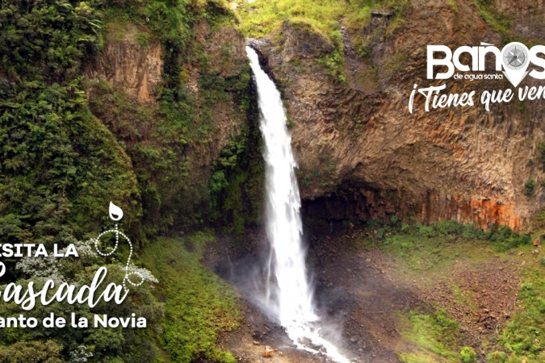

# JOHN
<!DOCTYPE html>
<html>
<head>
<META charset="UTF-8"/>
<title>DEBER DE DISEÑO</title>
</head>
<body background="FONDO1.jpg">

</head>
<body background="FONDO1.jpg">

<ul class="nav">
<li><a href="">E-MAILS</a>
<ul>
<li></li>
<li></li>
<li></li>

</li>
</ul>
</li>
<li><a href="">REDES SOCIALES</a>
<ul>
<li></li>
<li></li>
<li></li>
<li></li>
</ul>
</li>
<li><a href="">OFFICE</a>
<ul>
<li></li>
<li></li>
<li></li>
<li></li>
</ul>
</li>
<li><a href="">ATRACCIONES TURISTICAS DE TUNGURAHUA</a>
<ul>
<li></li>
<li></li>
<li></li>
<li></li>
<li></li>
</ul>
</li>

<table width="671" height="453" border="1">
  <tr>
    <td width="519"></td>
    <td></td>
  <td></td>
</tr>
  <tr>
    <td></td>
    <td width="136"></td>
 <td></td>
  </tr>
  <tr>
    <td></td>
    <td></td>
   <td></td> 
  </tr>
  <tr>
  <td height="125"></td>
  <td></td>
 <td></td>
 </tr>

<video CONTROLS src= "VIDEO1.mp4" alt""width="500" height="500" border="5"/>

</table>
</body>
</html>
